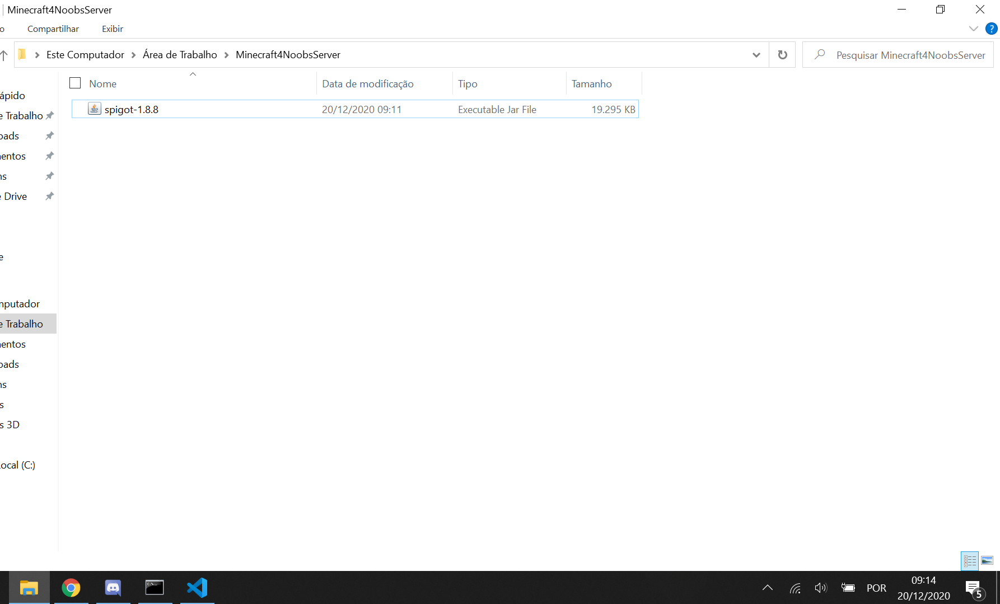
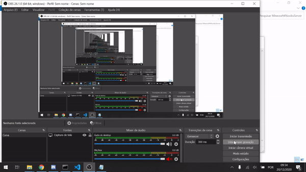
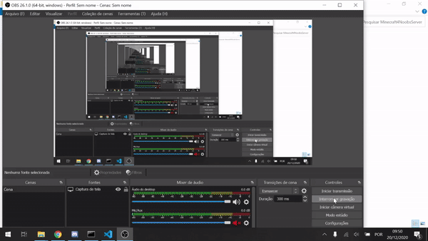

## Configurações do Ambiente Windows ###

#### Minecraft


O Minecraft tem inúmeras versões para serem utilizadas, porém, uma drástica atualização no modo de ataque do jogador fez uma divisão entre as atualizações. Portanto, utilizarei a versão 1.8.8/1.8.9.

#### Java e JDK (Java Development Kit)

Para fazer a instalção desses, somente siga os passos instruidos no meu repositório do <a href="https://github.com/paulorievrs/java4noobs/blob/master/2%20-%20Ambiente/2.1-Ambiente-Windows.md" >Java4Noobs</a>.

Feito isso, vamos seguir para a instalação do bukkit.

#### Bukkit/Spigot


O Bukkit/Spigot é a API de desenvolvimento de plugins para o Minecraft. Iremos utilizar o Spigot que é o mais atualizado, já que o "Bukkit" foi descontinuado.

Entre no site de download do Spigot, que é o GetBukkit, clicando <a href="https://getbukkit.org/download/spigot">aqui</a>. Role a tela até achar a versão 1.8.8 para fazer o download, ou clique <a href="https://getbukkit.org/get/hNiHm0tuqAg1Xg7w7zudk63uHr0xo48D"> aqui </a> para fazer o download direto.

Após baixa-lo, coloque-o em uma pasta, de preferência sozinho. Eu gosto de renomear o arquivo para ficar com o nome menor e melhor de trabalhar, mas é de sua preferência. Ficando assim:



Após isso tudo, é necessário inicializar esse arquivo para gerar os arquivos do servidor, mas antes, copie e cole esse arquivo spigot em outra pasta, pois precisaremos de uma copia não executada dele para utilizar a API.

Para iniciarmos esse servidor, existe uma maneira correta de fazer, em alguns casos funcionaria abrir esse arquivo mesmo e daria certo, porém, iremos fazer de um jeito que possamos ter mais controle do que está sendo executado.

Em primeiro lugar, abra seu bloco de notas mesmo e digite:

```
java -Xmx1024M -Xms1024M -jar spigot-1.8.8.jar nogui
```
No meu caso, ficou assim, mas aonde está <span style="font-weight: bold">spigot.1.8.8</span> coloque o nome do seu arquivo.

Esses dois primeiros parametros (-Xmx1024M e -Xms1024M) são para controlar a quantidade de memoria que seu servidor vai consumir. Se você tiver mais memória disponível pode aumentar esses limites, mas a fim desse tutorial, não será necessário pois não criaremos um servidor que irá consumir muita memória e queremos que seja acessível até nos computadores mais fracos. Para alterar basta aumentar os numeros "1024", mas ambos devem ter o mesmo valor.

Após inserir esse comando, precisamos salvar esse arquivo como .bat, que é o executavél de comandos do Windows. Para fazer isso, é só ir em Arquivo->Salvar Como->Selecione a pasta aonde o seu arquivo.jar está->Altere o tipo de arquivo para todos os arquivos->Coloque o nome como iniciar.bat->Salve-o normalmente.

O gif abaixo demonstra como deverá ser salvo esse arquivo:



Em alguns casos raros, esse comando não funciona, estão tente testar com:

```
@ECHO OFF SET BINDIR=%~dp0 CD "%BINDIR%" :start "%ProgramFiles(x86)%\Java\jre7\bin\java.exe" -Xmx1G -Xms1G -jar (COLOQUE AQUI O NOME DO SEU ARQUIVO).jar goto start
```
Ele é um pouquinho mais complexto e maior,  porém, duas coisas ali são importantes para ele funcionar, que é o diretório aonde está instalado seu JRE e o nome do arquivo, Então aonde está escrito: <span style="font-weight: bold">"%ProgramFiles(x86)%\Java\jre7\bin\java.exe"</span>altere para a pasta aonde está seu Java/JRE e aonde está <span style="font-weight: bold">(Coloque aqui o nome do seu arquivo)</span>, insira o nome do seu arquivo sem parenteses, e mantenha o .jar para que reconheça o tipo.

Após isso tudo, vamos iniciar o servidor!

Execute esse arquivo .bat, e ele irá gerar alguns arquivos extras dentro de sua pasta.


Ele travou a execução mesmo do servidor porque temos que alterar uma configuração no arquivo eula, basta abri-lo e alterar o eula de false para true.



Executando isso tudo novamente, como mostrado no gif, serão gerados vários arquivos novos que farão a configuração desse servidor. Se seu terminal finalizou parecido com o meu então deu tudo certo.

Agora, vamos seguir para você em sua máquina conseguir entrar no seu servidor, e algumas configurações adicionais que você pode fazer.

Há um arquivo chamado de:<span style="font-weight: bold">server.propreties</span>, abra-o, irei colocar abaixo como vem como padrão e explicando na frente das propriedades o que as mesmas fazem.

```properties

#Minecraft server properties
#Sun Dec 20 09:51:17 BRT 2020

generator-settings= 
#Eu sempre deixo vazio, essa propriedade da para inserir alguns dados de alteração do modo que é gerado o seu terreno.

op-permission-level=4 
#Ele define níveis de permissão para executar funções, deixe em 4 também.

allow-nether=true 
#Aqui altera se o Nether(inferno) vai estar funcionando ou não. True habilitado, False desabilitado.

resource-pack-hash= 
#Há uma maneira de definir uma textura como padrão por uma hash, para esse tutorial, 
#não tem necessidade, mas se você tiver essa hash, pode inseri-la aqui.

level-name=world 
#Aqui basicamente é o nome do mapa que foi gerado como padrão, mas você depois pode alterar esse nome e,
#apagar os arquivos de mapa e assim consequentemente alterar o nome do mesmo.

enable-query=false 
#Nada importante

allow-flight=false 
#Se é permitido o voo de aplicações terceiras como cheats/hacks, true permite, false não permite.

announce-player-achievements=true 
#Se vai mostrar as conquistas do jogadores. True mostra, False não mostra.

server-port=25565 
#A porta em que seu servidor vai ser executado, se você tiver conhecimento de outro processo 
#que está sendo executado nessa porta, o que é dificil, altera-a.

max-world-size=29999984 
#Aqui, altera-se o tamanho de mapa, exemplo, se tivese setado para 1000, o mundo iria ter 2000x2000 de tamanho.

level-type=DEFAULT 
#Como o mundo será gerado, você pode inserir FLAT, LEGACY, DEFAULT

enable-rcon=false 
#Permite acesso remoto para o console do servidor. True permite, false não permite.

level-seed= 
#A semente de geração de mapa.

force-gamemode=false 
#Se força a todos os jogadores a entrarem no modo de jogo padrão setado. Será alterado em uma das propriedades abaixo.

server-ip= 
#O IP em que seu servidor irá rodar. Nós vamos usar localhost.

network-compression-threshold=256 
#Deixe como padrão 256, complexo para explicar aqui.

max-build-height=256 
#O limite máximo de altura de blocos, ou seja, "o quanto pra cima" você pode construir.

spawn-npcs=true 
#Se vai spawner villagers/npcs. True spawna, false não spawna (spawnar = nascer).

white-list=false 
#Se vai ser um servidor por white-list, que só nicks permitidos possam entrar. True vai ser, False não vai ser. 

spawn-animals=true 
#Se vai spawnar(nascer) animais no mapa. True vai, false não vai.

hardcore=false 
#Se o servidor vai estar no modo hardcore. True vai, false não vai.

snooper-enabled=true 
#Se vai enviar informações para o Minecraft, não afeta tanto na performance do server, mas fica a critério pessoal. True envia informações, false não envia. 

online-mode=true
#Aqui é para definir bascimente se vai ser permitido entrar Minecraft Original ou não. Se deixar como True, somente pessoas com Minecraft Original vão poder entrar, como False, Minecraft Pirata também entra.

resource-pack=
#Link de um zip de uma texture pack para quem entrar ter que baixar.

pvp=true
#Se está permitido o Player vs Player, PVP. Como true permite, como false não permite.

difficulty=1
#Altera a dificuldade, passivo: 0, fácil: 1, normal: 2, hard: 3

enable-command-block=false
#Se o bloco de comando funciona ou não. True funciona, false não funciona.

gamemode=0
#Coloca o modo de jogo padrão ao entrar no servidor. [0 - Survival, 1 - Criativo, 2 - Aventura]

player-idle-timeout=0
#O quanto de tempo em minutos que o jogador pode ficar AFK, parado.

max-players=20
#A quantidade máxima de players que seu servidor pode aguentar. Quanto mais jogadores, 
#mais consumo de RAM ele vai ter, aí sim teria que alterar aquele arquivo .bat para suprir essa demanda.

spawn-monsters=true
#Se vai nascer Mobs, monstros (zumbi). True nasce, false não nasce.

generate-structures=true
#Se vai gerar estruturas, como vilas e templos. True gera, false não gera.

view-distance=10
#O máximo de chuncks que um player pode visualizar.

motd=A Minecraft Server
#Aquela descrição do servidor que fica na lista de adicionados.


```
Agora abaixo, como vou deixar meu arquivo, sem os comentários.

```properties
#Minecraft server properties
#Sun Dec 20 09:51:17 BRT 2020
generator-settings=
op-permission-level=4
allow-nether=true
resource-pack-hash=
level-name=world
enable-query=false
allow-flight=false
announce-player-achievements=true
server-port=25565
max-world-size=29999984
level-type=DEFAULT
enable-rcon=false
level-seed=
force-gamemode=true
server-ip=localhost
network-compression-threshold=256
max-build-height=256
spawn-npcs=true
white-list=false
spawn-animals=true
hardcore=false
snooper-enabled=true
online-mode=true
#Altere acima se tiver minecraft pirata.
resource-pack=
pvp=true
difficulty=0
enable-command-block=false
gamemode=1
player-idle-timeout=0
max-players=20
spawn-monsters=true
generate-structures=true
view-distance=10
motd=A Minecraft Server
```
Bom, feito isso, basta fechar o terminal, e executar o .bat novamente.

Assim, você consegue entrar no seu servidor criado normalmente, pelo IP localhost.

Em extras, ensinará a você jogar com outras pessoas, mas por enquanto só você em sua máquina consegue acessar.

Se você entende de inglês e quiser se aprofundar nessas propriedes do servidor basta acessar: <a href="https://minecraft.gamepedia.com/Server.properties">https://minecraft.gamepedia.com/Server.properties</a>
