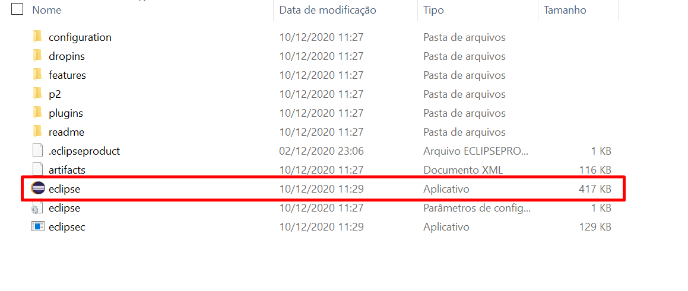
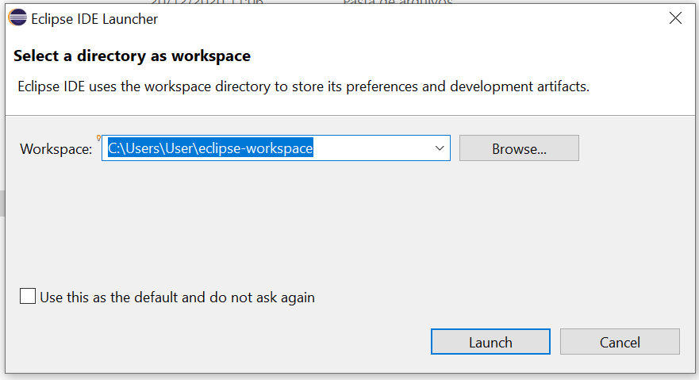

## IDE - Aonde iremos programar
Uma IDE, é o ambiente em que se desenvolvem os programas. Aqui nesse tutorial iremos utilizar o Eclipse, que na minha opnião é o melhor para conseguir produzir esse tipo de aplicação. Também é possível utilizar a IDE da JetBrains, o IntelliJ, mas algumas coisas são diferentes para criar.

Vamos fazer o download do Eclipse em específico.

Em primeiro lugar você vai entrar <a href="http://www.eclipse.org/downloads/packages/">nesse link</a>, descer até encontrar "Eclipse IDE for Java Developers" e fazer o download para Windows. Ou <a href="https://www.eclipse.org/downloads/download.php?file=/technology/epp/downloads/release/2020-12/R/eclipse-java-2020-12-R-win32-x86_64.zip&mirror_id=576">clique aqui</a> para já fazer o download direto.

Irá fazer um download de um arquivo ZIP. Com ele em mãos extraia o arquivo para algum local de preferência.

Abra a pasta dos arquivos e execute o Eclipse, o arquivo marcado na imagem abaixo.

Ao executar ele vai pedir para você selecionar sua pasta de trabalho, ou seja, aonde irá ficar seus arquivos, eu crei uma pasta plugins, mas você pode selecionar qualquer uma de sua preferência.

Pronto, vai abrir a IDE e está funcionando corretamente.