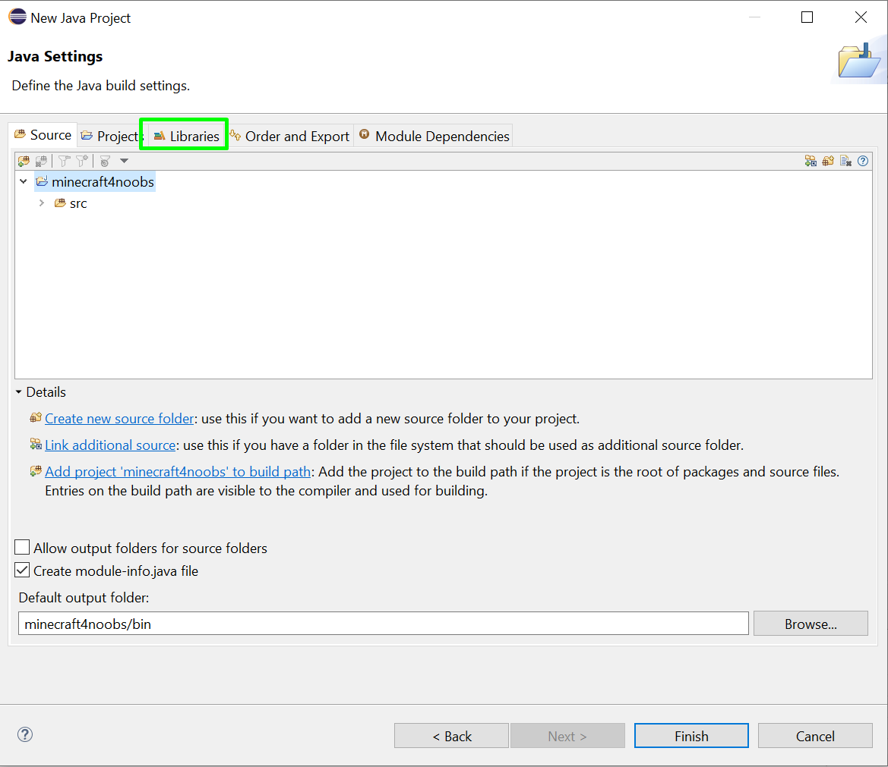

### Ambiente Eclipse

Agora passando por todos esses passos podemos já começar criando nosso primeiro plugin. Mas antes, ensinarei como iniciar um projeto para isso no Eclipse.

Ao abrir o Eclipse, feche suas abas até ficar assim:

1 - Após isso clique em **Create Java Project**

2 - Então, preencha com um nome do projeto, que é basicamente uma pasta que vai ser criada com esse nome, e o resto pode deixar como está, clicando em **Next**

3 - Então, clique em **Libraries**

4 - Clique em **Add External JARs...**

5 - Selecione aquele arquivo Spigot que baixamos e fizemos um backup para utilizar. E depois disso clique em finish.

6 - No final clique em **Create**.

7 - Criaremos um novo pacote, clique com o botão direito em src, vá em NEW e depois em Package

8 - Coloque o nome do pacote para o que desejar, mas, eu coloquei como fornoobs.minecraft. E aí clique em Finish.

9 - Agora criaremos uma classe, guarde esses passos pois sempre vamos criar classes novas.

Clique com o botão direito em src, vá em New e depois em Class.

10 - Coloque um nome para a classe, comumente é chamada de Main, que é a classe principal. E clique em Finish.

Eu sei que são muitos passos antes de começarmos a programar, mas é só da primeira vez. Depois ficará bem mais simples.

Agora vamos criar nossso primeiro plugin!

