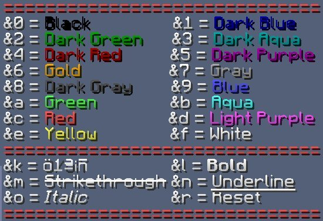
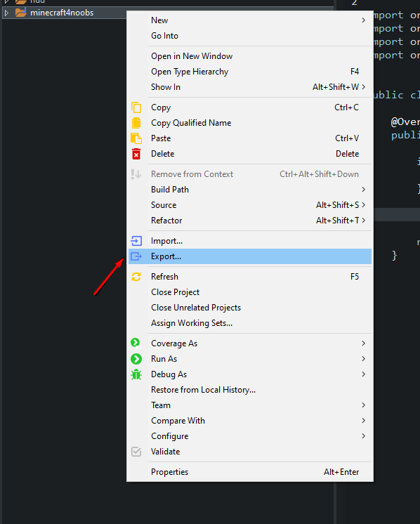
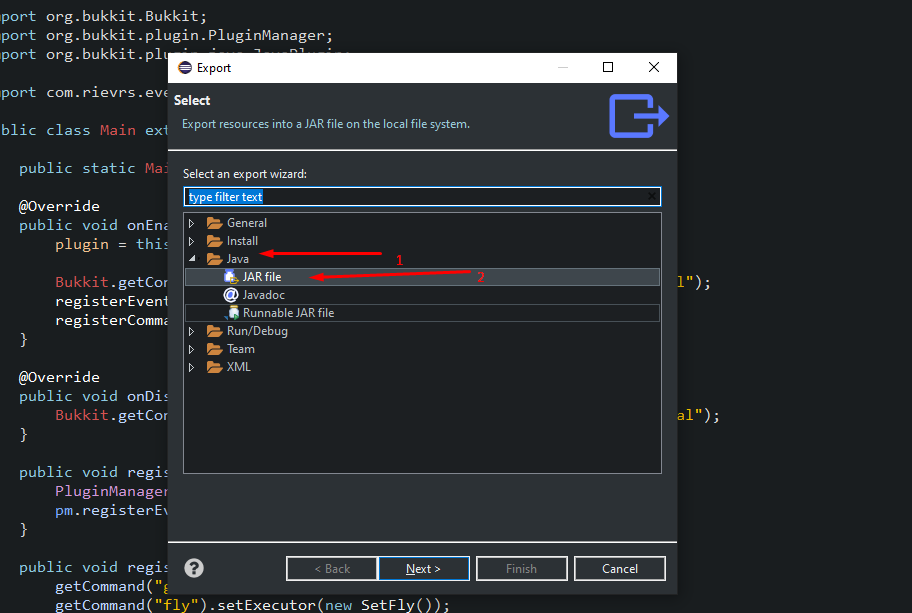
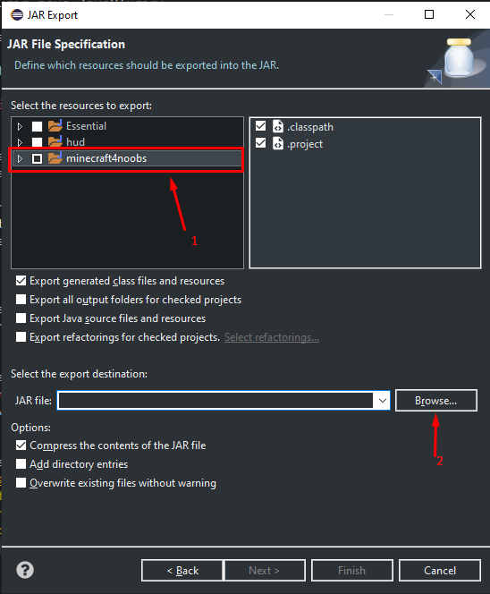
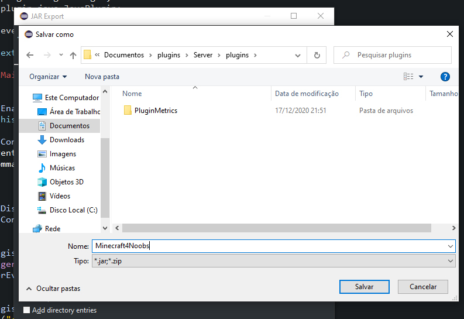
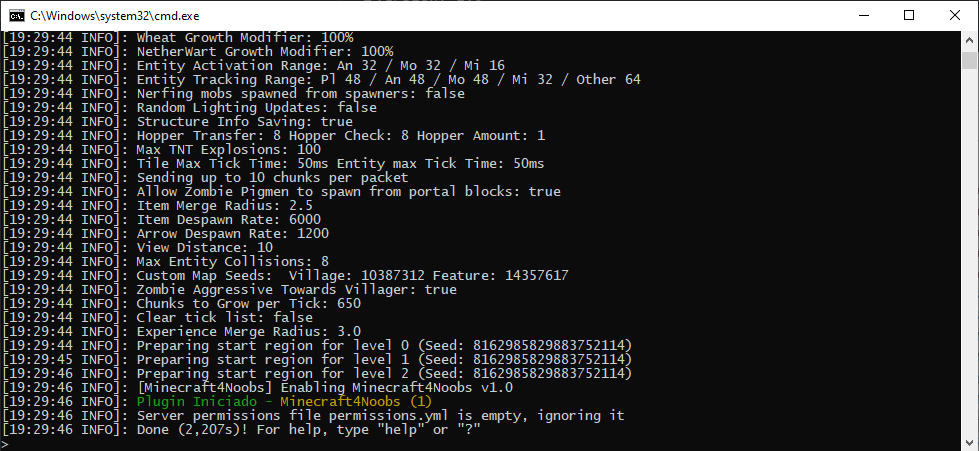

### Meu primeiro plugin

A estrutura da classe principal é como utilizamos em no Java4Noobs. Iremos criar a primeira função e construir em cima dela o resto.

O arquivo inicial de classe criado no tópico anterior é esse:

```java
package fornoobs.minecraft;

public class Main {

}
```

Nós precisamos de adicionar a essa classe os métodos do Bukkit/Spigot. Iremos adicionar a palavra chave **extends** para isso, e extenderemos para **JavaPlugin**. Ficando assim:

```java
package fornoobs.minecraft;

public class Main extends JavaPlugin {

}

```

Se tiver usando o Eclipse, irá dar um erro na IDE. Esse JavaPlugin vem do Bukkit/Spigot que nós não importamos, podemos fazer isso facilmente.

Clique do lado da palavra JavaPlugin e aperta **CTRL + ESPAÇO**, automaticamente o Eclipse irá importar, ficando assim:

```java
package fornoobs.minecraft;

import org.bukkit.plugin.java.JavaPlugin;

public class Main extends JavaPlugin {

}
```

Agora iremos **sobreescrever** o método de quando o Plugin é iniciado, utilizando o **@Override**.

```java
package fornoobs.minecraft;

import org.bukkit.plugin.java.JavaPlugin;

public class Main extends JavaPlugin {

	@Override
	public void onEnable() {
		
	}
	
}
```
Nessa caso, estamos utilizando o método **JÁ EXISTENTE** na classe JavaPlugin, para podermos adicionar mais itens e usos para ele. Como por exemplo uma mensagem de inicialização do plugin e para adicionarmos os comandos e eventos ao iniciar.

Vamos agora colocar uma mensagem para aparecer no terminal quando o plugin iniciar. 

```java
package fornoobs.minecraft;

import org.bukkit.plugin.java.JavaPlugin;

public class Main extends JavaPlugin {

	@Override
	public void onEnable() {
		Bukkit.getConsoleSender().sendMessage("§2Plugin Iniciado - §6Java4Noobs (1)");
	}
	
}
```
Utilizando:
```java
getConsoleSender()
```
O retorno é o envio de comandos para o servidor.

E utilizando:
```java
sendMessage('Mensagem')
```
Envia para o console/servidor a String que está contida.

Os caracteres "§" + algum outro caracter especifíco deixa com uma cor o chat/console e ficar melhor de identificar. A imagem abaixo tem algumas cores para você poder utilizar:



Voltando para o código, você poder ver que está com um erro no código, já que nós não importamos o Bukkit. Para fazer isso, é da mesma maneira, aperte **CTRL + ESPAÇO** e selecione a primeira opção.

No caso, código ficaria assim:

```java
package fornoobs.minecraft;

import org.bukkit.Bukkit;
import org.bukkit.plugin.java.JavaPlugin;

public class Main extends JavaPlugin {

	@Override
	public void onEnable() {
		
		Bukkit.getConsoleSender().sendMessage("§2Plugin Iniciado - §6Minecraft4Noobs (1)");
	}
	
}
```
Agora estamos enviando uma mensagem no console quando o plugin se inicia.

Seguindo um padrão podemos fazer o mesmo sobreescrevendo o método de quando se desliga o servidor. Ficando assim:

```java
package fornoobs.minecraft;

import org.bukkit.Bukkit;
import org.bukkit.plugin.java.JavaPlugin;

public class Main extends JavaPlugin {

	@Override
	public void onEnable() {
		
		Bukkit.getConsoleSender().sendMessage("§2Plugin Iniciado - §6Minecraft4Noobs (1)");
	}
	
	@Override
	public void onDisable() {
		Bukkit.getConsoleSender().sendMessage("§cPlugin Desligado - §6Minecraft4Noobs (1)");
	}
}
```

Basicamente o inicio da plugin já está pronto, mas vamos adicionar alguma interação no jogo para que seja algo legal de inicio.

Vamos criar o comando **/fly** para você voar e desativar o voo em qualquer modo.

Para ter aonde adicionarmos os comandos, vamos criar um método para armazenar esses comandos. Como por exemplo: 

```java
public void comandos() {
		
}
```

Dentro dessa classe Main mesmo.

E agora iremos criar o comando, crie uma nova classe com o nome de **SetFly**. O nome não precisa necessiaramente ser esse, mas é o que eu costumo utilizar.

Nessa classe iremos implementar o **CommandExecutor** para podermos usar o método onCommand.

Caso dê um erro, digite CTRL + ESPAÇO que irá importar o CommandExecutor, ficando assim:

```java
package fornoobs.minecraft;

import org.bukkit.command.CommandExecutor;

public class SetFly implements CommandExecutor {
	
	
	
}
```

Agora sobreescreveremos o método **onCommand** para adicionarmos nosso comando.

```java
public boolean onCommand(CommandSender sender, Command cmd, String s, String[] args) {
		
}
```
E para cada erro, só importaremos o necessário.

```java
package fornoobs.minecraft;

import org.bukkit.command.Command;
import org.bukkit.command.CommandExecutor;
import org.bukkit.command.CommandSender;


public class SetFly implements CommandExecutor {
	
	@Override
	public boolean onCommand(CommandSender sender, Command cmd, String s, String[] args) {
		
		
		return true;
	}
	
}
```
O código inteiro ficaria assim, só adicionei esse return true para parar de dar erro na IDE, pois como a função retorna um boolean iria ficar pedindo um retorno correto.

Vamos verificar se o comando foi digitador por um jogador com o seguinte IF:

```java
if(!(sender instanceof Player)) {
    return false;
}
```

Precisando importar:

```java
import org.bukkit.entity.Player;
```

Agora devemos armazenar em uma variável o Player que mandou o comando.

```java
Player p = (Player)sender;
```

Agora vamos já iniciar o comando. No caso, existe no Bukkit um método para verificar se o jogador tem o voo habilitado, porque se não tiver mesmo colocando ele para voar irá dar errado.

```java
if(p.getAllowFlight()) {

}
```
Ele retorna um boolean, se o voo estiver habilitado ou não.

Agora, se o voo tiver habilitado, quer dizer que ele já estava voando, então vamos desativar esse voo e a possibilidade dele voar.

```java
if(p.getAllowFlight()) {
    p.setAllowFlight(false);
    p.setFlying(false);
    p.sendMessage("§6Fly desativado");
} 
```
O método setFlying ativa o voo, e sendMessage manda uma mensagem somente para o jogador avisando que foi ativado seu voo.

E para desativar esse voo iremos usar um else.

```java
else {
    p.setAllowFlight(true);
    p.setFlying(true);
    p.sendMessage("§6Fly ativado");
}
```
E retornamos true. O código ficaria assim:

```java
package com.rievrs.etutorial;

import org.bukkit.Bukkit;
import org.bukkit.command.Command;
import org.bukkit.command.CommandExecutor;
import org.bukkit.command.CommandSender;
import org.bukkit.entity.Player;

public class SetFly implements CommandExecutor {
	
	@Override
	public boolean onCommand(CommandSender sender, Command cmd, String s, String[] args) {
		String errorMessage = "§cUtilize: /fly";
		
		if(!(sender instanceof Player)) {
			return true;
		}
		
		Player p = (Player)sender;
						
        if(p.getAllowFlight()) {
            p.setAllowFlight(false);
            p.setFlying(false);
            p.sendMessage("§6Fly desativado");
        } else {
            p.setAllowFlight(true);
            p.setFlying(true);
            p.sendMessage("§6Fly ativado");
        }
        return true;

	}
	
}
```
Tá funcionando já o plugin, mas só para rodar 100% iremos adicionar tratativas de erro. Ficando assim:

```java
package com.rievrs.etutorial;

import org.bukkit.Bukkit;
import org.bukkit.command.Command;
import org.bukkit.command.CommandExecutor;
import org.bukkit.command.CommandSender;
import org.bukkit.entity.Player;

public class SetFly implements CommandExecutor {
	
	@Override
	public boolean onCommand(CommandSender sender, Command cmd, String s, String[] args) {
		String errorMessage = "§cUtilize: /fly";
		
		if(!(sender instanceof Player)) {
			return true;
		}
		
		Player p = (Player)sender;
		try {
						
			if(p.getAllowFlight()) {
				p.setAllowFlight(false);
				p.setFlying(false);
				p.sendMessage("§6Fly desativado");
			} else {
				p.setAllowFlight(true);
				p.setFlying(true);
				p.sendMessage("§6Fly ativado");
			}
			return true;
			
			
		} catch (Exception e) {
			
			Bukkit.getConsoleSender().sendMessage("Error no setFly: " + e.getMessage()); //enviando erro para o console e registrar
			
		}
	
		return false;
		
	}
	
}
```
Voltando para a classe Main, precisamos ativar esse comando para que quando o servidor iniciar possa ser usado. Assim:

```java
public void comandos() {
    getCommand("fly").setExecutor(new SetFly());
}
```
Basicamente tá funcionado, mas precisamos adicionar ao plugin.yml, que é um arquivo criado manualmente e adiciona algumas configurações e informações sobre o plugin. Clique com o botão direito na pasta SRC, clique em New e depois em New File. Coloque o nome como plugin.yml.

Dentro dele escreveremos:

```yml
main: fornoobs.minecraft.Main
version: 1.0
name: Minecraft4Noobs
commands:
  fly:
    description: Muda para voando/nao voando
```
**Descrição:**
<ul>
    <li><strong>main:</strong> Direcionando aonde está a main.</li>
    <li><strong>version:</strong> Versão que está o plugin.</li>
    <li><strong>name:</strong> Nome do plugin.</li>
    <li><strong>commands:</strong> Apresenta os comandos, um a um, com sua descrição.</li>
</ul>

Agora vamos criar o plugin, e adicionar-mos no jogo.

No package explorer clique com o botão direito na pasta do projeto e vá em export.



Após isso selecione Java e JAR file e clique em next.



Depois selecione o projeto que quer exportar e clique em Browse... selecionando a pasta de plugins do servidor 



Salve o arquivo.



E assim ficaria o servidor após iniciar:




