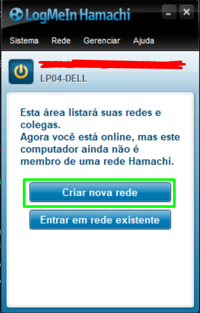
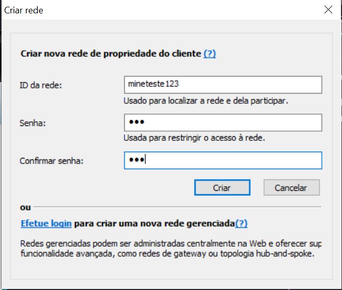
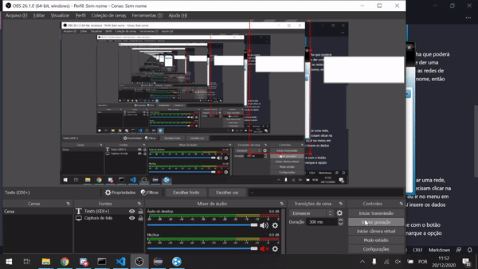

## Jogando com amigos (Gratuito)

Na maneira ensinada nos <a href="../2 - Ambiente">ambientes</a> não era posísvel jogar com outras pessoas no seu servidor. Aqui irei ensinar como realizar isso.

Iremos utilizar o Hamachi para mantermos uma conexão de rede com os seus amigos ou outros membros. Faça o download dessa ferramenta <a href="https://www.softonic.com.br/download/hamachi/windows/post-download">aqui</a>.

Ao baixar, instale-o como um programa comum e inicie ele após a instalação. 

Ligue o programa, e ele pedirá para criar uma conta, crie ela e assim conseguirá utilizar.

Vá em criar uma nova rede clicando na parte verde:

Crie uma rede qualquer, e coloque uma senha que poderá ser removida depois, mas lembre-se dela. Se der uma mensagem de que já existe a rede é porque as redes de todos os usuários não podem ter o mesmo nome, então altere para outro.

Só aonde o servidor está iniciado precisa criar uma rede, outras pessoas entrarem no seu servidor precisam clicar na opção de entrar em uma rede existente ou ir no menu em cima, rede->entrar em rede existente. Aí insere os dados que você colocou.

Para remover a senha de sua rede, clique com o botão direito nela, vá em definir acesso e desmarque a opção exigir senha para entrar na rede.

No IP do seu server.properties, você vai copiar o seu IPV4 clicando nos números abaixo do MENU e colar lá. E seus amigos irão entrar por ele.

E é isso :)

